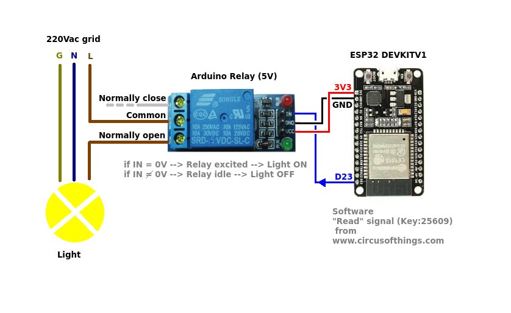
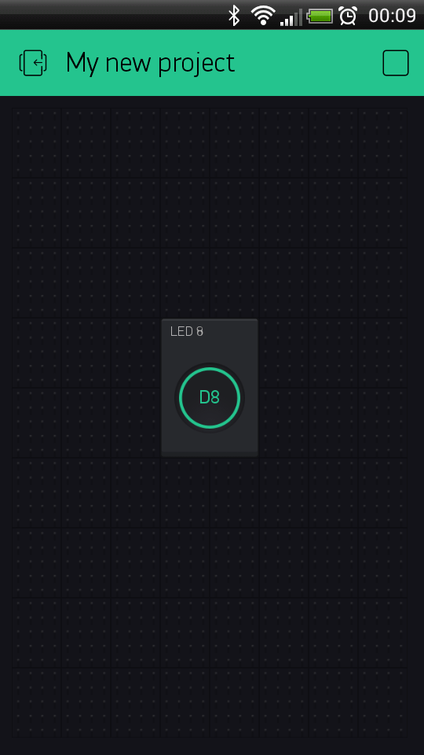

# Google assistant based home automation 

## Hello Friends
> My name is arun suthar.\
> I am teaching how to make a AI based home  automation

## basic of project
>In is project you control a led buld of any electical device in your home.\
>for this projrct you nead some hardwere as well as softwere.

## Components

### Hardwere
>esp32\
>relay\
>led blud\
>jummer wire\
>power supply

### softwere
>[arduino ide](https://www.arduino.cc/en/main/software) \
>[IFTTT](https://ifttt.com/) \
>[blynk](https://blynk.io/) 

## Connection

 
 
## softwrer

### blynk
>first you download blynk app from playstore\
>after you dowload make account and take new project.\
>select esp32 boad and take button and take gpio pin which you connect with relay.
>blynk app mail you a authorizer code save that code for later codeing.

### arduino 
>you can take code direct from blynk website.
  -[arduino CODE](https://examples.blynk.cc/?board=ESP32&shield=ESP32%20WiFi&example=GettingStarted%2FPushData)\
>you add your wifi name and password and authorizer code to this code.

### IFTTT
>Till now we make a iot project with control with app.\
>now we connect with google assistant.\
>for that take ifttt website make a webhoke and take blynkserver and enter in that
