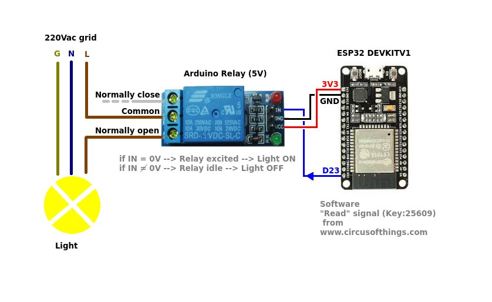

# Google assistant based home automation 

## Hello Friends
> My name is arun suthar.\
> I am teaching how to make a AI based home  automation

## basic of project
>In is project you control a led buld of any electical device in your home.\
>for this projrct you nead some hardwere as well as softwere.

## Components

### Hardwere
>esp32\
>relay\
>led blud\
>jummer wire\
>power supply

### softwere
>[arduino ide](https://www.arduino.cc/en/main/software) \
>[IFTTT](https://ifttt.com/) \
>[blynk](https://blynk.io/) 

## Connection
- 
